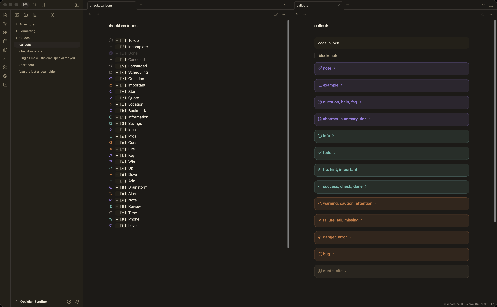

# Praxis

Praxis is a quiet, configurable theme for Obsidian. It is built as a standalone theme, with a lightweight companion stylesheet for Obsidian Publish.

The theme follows Obsidian's CSS variable system and keeps a Minimal-inspired helper-class surface for cards, image grids, table layouts, title helpers, callouts, and image filters.



## Install

1. Create a folder named `Praxis` in your vault at `.obsidian/themes/Praxis`.
2. Add `theme.css` and `manifest.json` to that folder.
3. Open Obsidian Settings -> Appearance -> Themes and select `Praxis`.

### Install with BRAT

BRAT can install Praxis directly from GitHub while the theme is in beta or before it is listed in the community theme catalog.

1. Install and enable the `BRAT` community plugin.
2. Open BRAT settings and add this repository as a beta theme: `https://github.com/voitech/obsidian-praxis`.
3. Open Obsidian Settings -> Appearance -> Themes and select `Praxis`.

Update the repository URL if you are using a fork or a different GitHub owner.

Praxis supports light and dark modes and targets Obsidian 1.13.0 or newer. It uses Geist and Geist Mono when available, then falls back to Inter and system fonts.

## Style Settings

Praxis works without plugins. If you install the optional Style Settings community plugin, the theme exposes settings for:

- interface, text, and monospace fonts
- text size and readable line width
- accent colors
- background contrast
- note title and heading weight
- link underlines and H1 borders
- table grid lines
- callout style
- compact Properties layout, label width, row gap, and input height
- optional click locking for custom checkbox statuses
- card width, card image height, card image fit, and image grid gap

Style Settings custom properties use stable `--praxis-*` variables where possible, so user settings can survive theme updates.

## Helper Classes

Praxis keeps the helper classes commonly used with Minimal-style workflows:

- Title helpers: `hide-title`, `alt-title`, `h1-borders`
- Tables: `table-100`, `table-full`, `table-small`, `table-tiny`, `table-nowrap`, `table-lines`, `table-numbers`, `table-tabular`, `row-hover`, `row-alt`, `row-lines`, `row-lines-off`, `col-alt`, `col-lines`, `table-col-1-150`, `table-col-1-200`
- Cards: `cards`, `list-cards`, `cards-16-9`, `cards-1-1`, `cards-2-1`, `cards-2-3`, `cards-cols-1` through `cards-cols-8`, `cards-cover`, `cards-align-bottom`
- Images: `img-grid`, `img-grid-ratio`, `img-zoom`
- Image suffixes: `#outline`, `#interface`, `#invert`, `#invertW`, `#circle`
- Checkbox icons: custom task statuses use Lucide-based icons for `/`, `-`, `>`, `<`, `?`, `!`, `*`, quote, `l`, `b`, `i`, `S`, `I`, `p`, `c`, `f`, `k`, `w`, `u`, `d`, `+`, `B`, `a`, `n`, `R`, `t`, `P`, `L`
- Callouts: standard callouts and `[!author]` use Lucide icons; `|noicon` metadata hides callout icons

Some app helpers rely on Obsidian's rendered Markdown structure and modern Chromium CSS support.

## Obsidian Publish

`publish.css` is a public companion stylesheet for Obsidian Publish. It shares Praxis colors, typography, callouts, cards, table helpers, and image helpers while staying separate from the app theme.

To use it, publish `publish.css` at the root of your Publish vault. Style Settings does not run on Obsidian Publish, so Publish customization should be done directly through CSS variables in `publish.css`.

## Development

Praxis intentionally has no runtime or development dependencies. The package scripts only validate the distributable files:

```sh
npm run validate
```

The validator checks required files, manifest fields, Style Settings markers, CSS balance, Publish file size, and absence of private local paths.

## Community Theme Submission

The repository is prepared for Obsidian community theme submission with:

- `theme.css`
- `manifest.json`
- `README.md`
- `LICENSE`
- `screenshot.png`

The community theme entry should use:

```json
{
  "name": "Praxis",
  "author": "voitech",
  "repo": "voitech/obsidian-praxis",
  "screenshot": "screenshot.png",
  "modes": ["dark", "light"]
}
```

Update `repo` if the GitHub owner or repository name differs.

## Credits

Praxis is not a fork of Minimal. It is inspired by the architecture, helper-class conventions, and Publish separation used by [Minimal](https://github.com/kepano/obsidian-minimal) and [Minimal Publish](https://github.com/kepano/obsidian-minimal-publish) by Steph Ango. Those projects are released under the MIT License.
